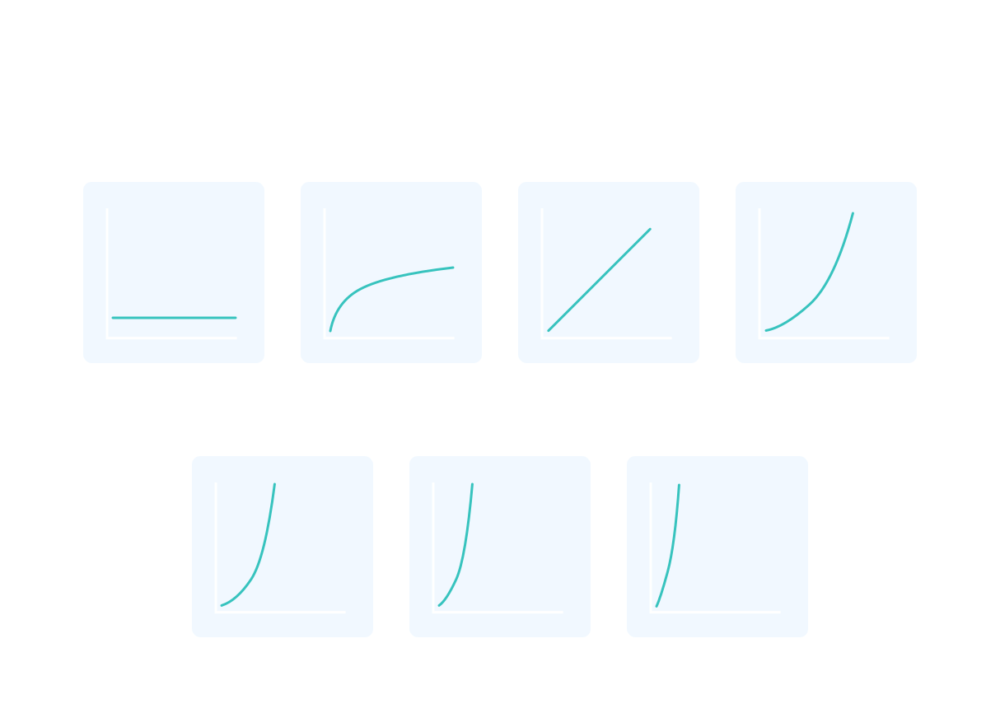

# Why Big O?

Computers and the processors that run them keep getting more powerful that makes them seem like taking no time running complex programs that we use every day. However, when writing programs, making smart programming choices might be the difference between success and failure since programs start to deal with massive amounts of data as they scale.

In computer science, we define how efficient a program is by its runtime. That's where Big O notation comes into play. **Big O notation aims to calculate how long an algorithm takes to run. It's how we compare the efficiency of different approaches to a problem.**

With Big O notation, we express the runtime in terms of how quickly it grows relative to the input, as the input gets arbitrarily large.

Let's break that down:

1. How quickly the runtime grows—It's hard to pin down the exact runtime of an algorithm even though you can time a computer program. It depends on the speed of the processor, what else the computer is running, etc. For example, a program that takes 12 nanoseconds on one computer could take 45 milliseconds on another. So instead of talking about the runtime directly, we use big O notation to talk about how quickly the runtime grows.

2. Relative to the input—If we measured our runtime directly, we could express our speed in seconds. Since we measure how quickly our runtime grows, we need to express our speed in terms of how many instructions the computer has to perform based on the size of the input. With Big O notation, we use the size of the input, which we call "n". We can say runtime grows "on the order of the size of the input" O(n) or "on the order of the square of the size of the input" O(n^2).

3. As the input gets arbitrarily large—Our algorithm may have steps that seem expensive when n is small but are eclipsed eventually by other steps as n gets huge. For big O analysis, we care most about the stuff that grows fastest as the input grows, because everything else is quickly eclipsed as n gets very large. (If you know what an asymptote is, you might see why "big O analysis" is sometimes called "asymptotic analysis.")

If this seems abstract so far, that's because it is. Let's look at some examples.

## Common Runtimes

Before we delve into the multiple runtime cases, let’s see the different common runtimes a program could have. Below is a list of common runtimes that run from fastest to slowest.

- O(1). This is constant runtime. This is the runtime when a program will always do the same thing regardless of the input. For instance, a program that only prints “hello, world” runs in O(1) because the program will always just print “hello, world”.
- O(log n). This is logarithmic runtime. You will see this runtime in search algorithms.
- O(n). This is linear runtime. You will often see this when you have to iterate through an entire dataset.
- O(n\*logn). You will see this runtime in sorting algorithms.
- O(n^2). This is an example of a polynomial runtime. You will see this runtime when you have to search through a two-dimensional dataset (like a matrix) or nested loops.
- O(2^n). This is exponential runtime. You will often see this runtime in recursive algorithms.
- O(n!). This is factorial runtime. You will often see this runtime when you have to generate all of the different permutations of something. For instance, a program that generates all the different ways to order the letters “abcd” would run in this runtime.



## Some examples

```
  function getFirstItem(items) {
    return items[0];
  }
```

**This function runs in O(1)O(1) time (or "constant time") relative to its input.** The input array could be 1 item or 1,000 items, but this function would still require one "step."

```
  function displayAllItems(items) {
    items.forEach(item => {
      console.log(item);
    });
  }
```

**This function runs in O(n) time (or "linear time") relative to its input, where n is the number of items in the array.** If the array has 10 items, we have to print 10 times. If it has 1,000 items, we have to print 1,000 times.

```
  function sumAllPossibleOrderedPairs(items) {
    items.forEach(firstItem => {
      items.forEach(secondItem => {
        return firstItem + secondItem;
      });
    });
  }
```

Here we're nesting two loops. If our array has n items, our outer loop runs n times, and our inner loop runs n times for each iteration of the outer loop, giving us n^2. **Thus this function runs in O(n^2) time (or "quadratic time") relative to its input.** If the array has 10 items, we have to print 100 times. If it has 1,000 items, we have to print 1,000,000 times.

## A few rules of thumb when dealing with Big O

### 1. N could be the actual input or the size of the input

Sometimes n is an actual number that's an input to our function, and other times n is the number of items in an input array (or an input map, or an input object, etc.).

```
  function sayHiNTimes(n) {
    for (let i = 0; i < n; i++) {
      console.log('hi');
    }
  }

  function printAllItems(items) {
    items.forEach(item => {
      console.log(item);
    });
  }
```

Both of these functions have O(n) runtime, even though one takes an integer as its input, and the other takes an array.

## 2. Drop the constants

**This is why Big O notation rules.** When you're calculating the Big O complexity of something, you throw out the constants.

O(2n), we call O(n).
O(1+n/2+100), we call O(n).

The reason we can get away with this is Big O notation only deals with what happens when n gets arbitrarily large. As n gets big, adding 100 or dividing by 2 has a decreasingly significant effect.

## 3. Drop the less significant terms

This is similar to rule#2.

O(n + n^2), which we call O(n^2).

Even if it were O(n^2/2 + 100n), it would still be O(n^2)

Similarly:

O(n^3 + 50n^2 + 10000)is O(n^3)

O((n + 30) \* (n + 5))O((n+30)∗(n+5)) is O(n^2)

Again, we can get away with this because **the less significant terms quickly become, well, less significant as n gets big.**

## 4. We're usually talking about the "worst-case"

For example, if we were searching for a value within a collection and/or array, the best case would be if we found that element in the first place we looked. The worst-case scenario, such as if we searched for a value, looked in the entire dataset and did not find it. We typically focus on the worst-case scenario, so there is an upper bound of runtime to communicate.

The example above is O(n) runtime, and the "worst-case" part would be implied. But to be more specific, we could say this is worst-case O(n) and best case O(1) runtime. For some algorithms, we can also make rigorous statements about the "average case" runtime.

Often this "worst-case" stipulation is implied. But sometimes you can impress your interviewer by saying it explicitly.

## Questions

1. Suppose we had a function that performed one step for each element in a collection of input data. What would the Big O time complexity be for this function?

   - Constant: O(1)
   - Logarithmic: O(logn)
   - Quadratic: O(n^2)
   - Linear: O(n)

2. Suppose we had a function that iterated through a collection of data once to find the minimum value, and then again in a separate iteration to find the maximum value. How would we write the Big O time complexity?

   - O(2n)
   - O(n^2)
   - O(n)
   - O(n + n)

3. An identical algorithm written in two different programming languages will have the same Big O runtime complexity.

   - True
   - False

4. Why are constant factors (such as 2N) and lower order terms (N^2 + N becomes N^2) ignored when writing Big O notation?

   - As the input to the function grows toward infinity, lower order terms and constant factors cancel each other out
   - We cannot be sure of the significance of lower order terms as they relate to the constant factors
   - As the input to the function grows toward infinity, lower order terms and constant factors become insignificant compared to the term with the higher order of magnitude
   - We do incorporate lower order terms and constant factors into Big O!

5. Suppose we had a function that took in a list of data as an input. For each element in the list, the function compared it to every other element in the collection. What would the Big O time complexity be for this function?

   - Constant: O(1)
   - Quadratic: O(n^2)
   - Exponential: O(2^n)
   - Linear: O(n)

6. With Big O notation, we evaluate a function’s runtime efficiency based on the **\_**?

   - Number of conditional statements.
   - Number of variables created within the function
   - Size of the inputs
   - Helper function(s)

7. Why don’t we use time-elapsed (5 minutes, for example) as a measurement for an algorithm’s runtime?

   - Different units of measurement makes this approach not feasible
   - This approach would not be relevant in quantum-computing
   - Time is relevant
   - This approach depends on the speed of the processor, what else the computer is running, different programming language etc.

8. A function which only performed the operation 6 + 9 would be which Big O time complexity?

   - Factorial: O(n!)
   - Logarithmic: O(logn)
   - Constant: O(1);
   - Linear: O(n)

9. What is the least efficient runtime complexity?

   - O(1)
   - O(2^n)
   - O(n!)
   - O(logn)

10. Search algorithms often result in which Big O complexity?

    - Constant: O(1)
    - Logarithmic: O(logn)
    - Linear: O(n)
    - Quadratic: O(n^2)


### References

📄 [Big O Notation](https://www.interviewcake.com/article/python/big-o-notation-time-and-space-complexity?)